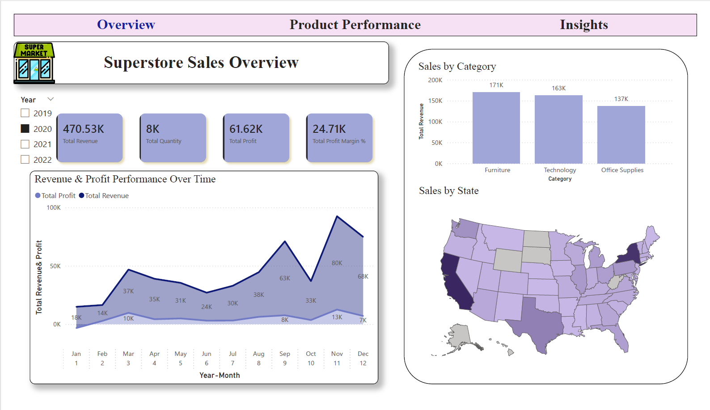
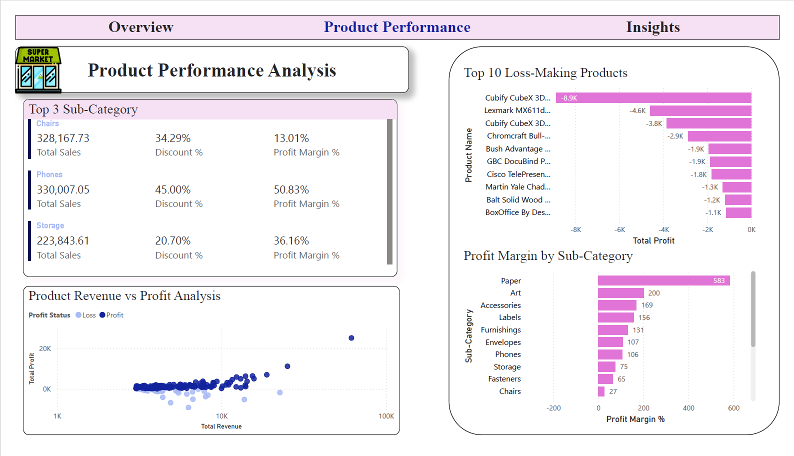
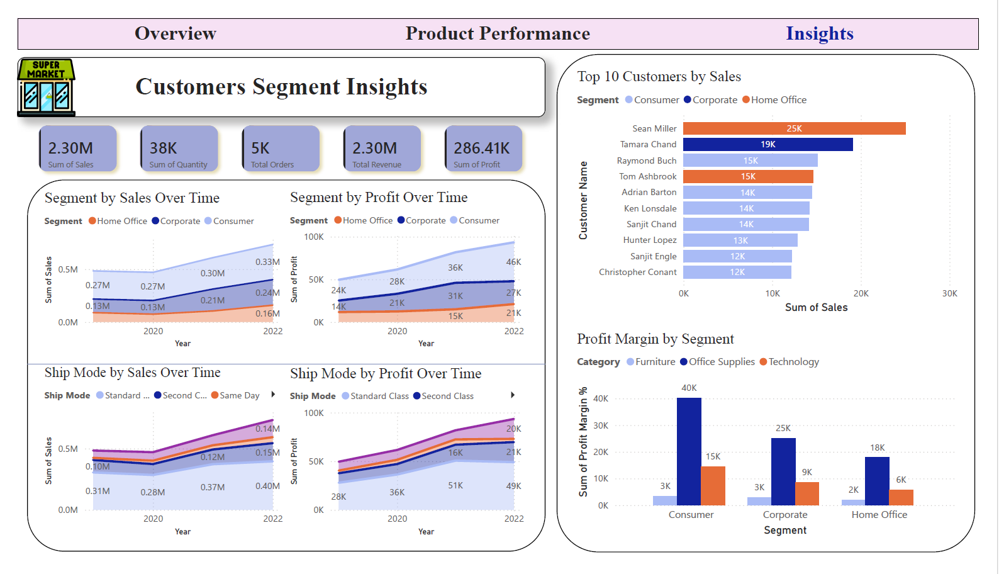

# 📊 Superstore Sales Performance Dashboard

## 📌 Project Overview

This project analyzes retail sales performance using the Superstore dataset.  
The objective is to transform raw transactional data into actionable business insights using Power BI.

The dashboard progresses from high-level KPIs to detailed product, customer, geographic, and strategic insights.

---

## 🎯 Business Objectives

This dashboard answers the following key business questions:

- Which states and cities generate the highest revenue?
- Which product categories are both best-selling and most profitable?
- Which sub-categories and products are underperforming?
- Which customer segment contributes the most profit?
- What is the most preferred shipping mode?
- How has company performance trended over time?
- Where are the key risks and growth opportunities?

---

## 🗂 Dataset

- **Source:** Superstore retail dataset
- **Granularity:** Transaction-level data
- **Time Range:** Multi-year historical data

---

## 🧹 Data Processing & Modeling

### ✔ Data Validation

- Verified correct data types
- Checked for null values
- Reviewed duplicates
- Identified negative profit transactions
- Validated discount column consistency

### ✔ Data Modeling (Star Schema)

- Created a separate **Date Table** using DAX
- Included:
  - Year
  - Month
  - Quarter
  - Year-Month
- Established a one-to-many relationship with the Orders table
- Marked as official Date Table

This enables:

- Time intelligence (YoY growth, trend analysis)
- Continuous date tracking
- Best practice data modeling

---

## 📈 Dashboard Structure

### 1️⃣ Overview

- Total Revenue
- Total Profit
- Profit Margin %
- Total Orders
- Revenue & Profit Trend
- Sales by Category
- Sales by State (Map)
  

---

### 2️⃣ Product Performance

**Focus:** Identify top performers and profitability risks.

- Top 3 Sub-Categories
- Top 10 Loss-Making Products
- Profit Margin by Sub-Category
- Revenue vs Profit Scatter Analysis
  

---

### 3️⃣ Customer & Operational Insights

**Focus:** Customer profitability and operational behavior.

- Segment Sales & Profit Trends
- Top 10 Customers by Revenue
- Profit Margin by Segment
- Shipping Mode Analys
  

---

## 🔍 Key Insights

### 1️. Revenue Growth with Margin Pressure

- Overall revenue shows a consistent upward trend across recent years.
- Profit growth is slower compared to revenue growth.
- This indicates potential margin compression driven by discounting or product mix imbalance.

**Business Impact:** Growth is positive, but profitability efficiency requires optimization.

---

### 2️. Technology Category Drives Profitability

- Technology generates the highest overall profit contribution.
- Office Supplies delivers stable revenue but lower margins.
- Furniture shows strong revenue but inconsistent profitability.

**Business Impact:** Strategic marketing investment should prioritize high-margin categories to maximize returns.

---

### 3️. Revenue Concentration Risk

- A small group of top customers contributes a significant share of total revenue.
- High dependency on top accounts increases financial risk exposure.

**Business Impact:** Diversifying the customer base will reduce revenue concentration risk and improve stability.

---

### 4️. Loss-Making Products Reduce Overall Margin

- Multiple products consistently generate negative profit.
- Higher discount percentages strongly correlate with loss-making transactions.

**Business Impact:** SKU-level pricing review and discount optimization are required to protect margins.

---

### 5. Consumer Segment Leads Profit Contribution

- The Consumer segment generates the highest revenue and profit.
- Corporate and Home Office segments contribute steadily but at lower scale.

**Business Impact:** Consumer-focused campaigns provide the strongest financial return.

---

## 🚀 Strategic Recommendations

### 1. Improve Profit Margin Efficiency

- Review discount policies for low-margin sub-categories.
- Introduce margin threshold controls for promotional campaigns.

---

### 2. Prioritize High-Margin Categories

- Increase marketing investment in Technology.
- Bundle high-margin products with complementary low-margin items.

---

### 3. Address Loss-Making Products

- Conduct detailed SKU-level profitability analysis.
- Reprice, bundle, or discontinue persistently unprofitable products.

---

### 4. Optimize Regional Strategy

- Investigate states with low margin performance.
- Adjust logistics strategy or regional pricing structure.

---

### 5. Expand Customer Base

- Reduce reliance on top 10 revenue-contributing customers.
- Develop acquisition strategies targeting mid-tier and emerging customers.

---

## 💼 Business Value

This dashboard converts transactional retail data into actionable business intelligence by:

- Providing real-time financial performance visibility
- Identifying margin leakage and profitability risks
- Highlighting revenue concentration exposure
- Enabling geographic and segment-level optimization
- Supporting data-driven strategic decision-making

---

## 👨‍💻 Author

**Chan Xu Peng**  
**Date:3/3/2026**
---
